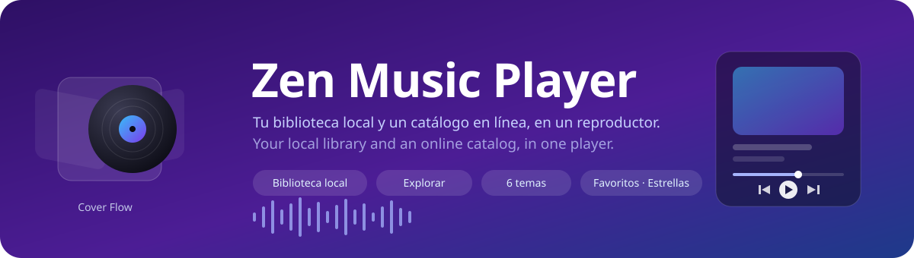

<div align="center">



# Zen Music Player

**A desktop music player that treats your local folder and the whole online catalog as one library.**

**Un reproductor de escritorio que trata tu carpeta local y el catálogo en línea como una sola biblioteca.**


### [English](#english) · [Español](#español)

</div>

> [!NOTE]
> **Work in progress · personal use.** Online playback needs a `yt-dlp` you supply yourself — read [Legal and scope](#-legal-and-scope) before packaging or distributing anything from this repository.
>
> **En desarrollo · uso personal.** La reproducción en línea necesita un `yt-dlp` que aportas tú — lee [Aspectos legales y alcance](#-aspectos-legales-y-alcance) antes de empaquetar o distribuir nada de este repositorio.

---

## English

### ✨ What it does

You keep your music in a folder. You also listen to things you don't own. Most players make you choose: a local library manager that ignores the internet, or a streaming app that ignores your files.

Zen Music Player puts both in the same grid. **Open a folder** and your files are scanned, grouped by artist and album, and drawn with their embedded cover art. Switch to **Explorar** and you search real artists, albums and charts — the same cards, the same detail panel, the same queue. Anything you like from there can be **added to your library**, where it sits next to your local files and survives restarts.

- **Local library** — recursive folder scan for `.mp3`, `.flac`, `.wav`, `.ogg`, `.m4a`, `.aac`, with embedded cover art.
- **Online catalog** — real artists, albums, tracklists and current charts, no API key and no account.
- **Five tabs** — Artists, Albums, Songs, Favorites and Explore, all sharing one player.
- **Cover Flow** — a 3D carousel for albums and artists, driven by the arrow keys.
- **Favorites and 5-star ratings**, with a Favorites tab that filters by minimum rating.
- **Six themes** and a resizable, collapsible player that turns into a horizontal mini-bar.
- **Everything is remembered** — theme, layout, volume, ratings, favorites, last folder and your added online tracks.

### 📋 Requirements

- **[Node.js](https://nodejs.org/) 18 or newer** (Electron 42 and Vite 5 need a modern runtime).
- **Windows 10/11** for the tested workflow. The Forge makers for `.deb`, `.rpm` and macOS `.zip` are configured but untested — see [Notes and limitations](#-notes-and-limitations).
- **[`yt-dlp`](https://github.com/yt-dlp/yt-dlp)** — needed only for online playback. It is *not* committed to this repository; see the installation step below.
- An internet connection for the Explore tab. The local library works fully offline.

### 🚀 Installation

#### 1. Clone and install dependencies

```bash
git clone https://github.com/piero-valles-maravi/zen-music-player.git
```

```bash
cd zen-music-player && npm install
```

#### 2. Add `yt-dlp` (only if you want online playback)

The app looks for `bin/yt-dlp.exe` inside the project, then for a `yt-dlp` on your `PATH`. Download the official Windows build into `bin/`:

```bash
curl -L -o bin/yt-dlp.exe https://github.com/yt-dlp/yt-dlp/releases/latest/download/yt-dlp.exe
```

The binary is gitignored on purpose: it is ~18 MB, and redistributing it with the app is exactly what [Legal and scope](#-legal-and-scope) tells you not to do. Skip this step and everything except online playback still works.

#### 3. Run it

```bash
npm start
```

On Windows you can also double-click `launch.bat`, which does the same thing from the project folder.

#### 4. Build a package (optional)

```bash
npm run make
```

Output lands in `out/`. `forge.config.js` ships `bin/` as an extra resource, so a packaged build carries whatever `yt-dlp` you put there.

### 🖱️ Usage

**Load your music.** Click **Abrir carpeta**, pick the root of your collection and the app walks every subfolder. Artist and album are inferred from the folder layout — `…/Artist/Album/track.mp3` — while the cover comes from the file's embedded tags. The folder is remembered, so the next launch reloads it by itself.

**Browse.** Tabs across the top: *Artistas*, *Álbumes*, *Canciones*, *Favoritos*, *Explorar*. In the grids:

| Action | Result |
| --- | --- |
| **Single click** on a card | Opens the detail panel for that album or artist |
| **Double click** on a card | Plays the whole album or artist |
| **Click the play overlay** | Plays immediately, without opening the detail |
| **Hover an artist card** | Fans out up to three album covers; click one to open that album |
| **Right click** | Menu: play, queue, favorite, rate 1–5 stars, copy title or artist |
| **♥ on a card** | Toggles the whole album or artist as favorite |

**Explore.** The *Explorar* tab opens on the current charts. Type a query and you get tracks, albums and artists; click an album or artist to drill into its tracklist. The **＋** button on a row adds that track to your library, and **✓** means it is already there. Added tracks survive restarts and carry a small cloud badge, so you always know what is streamed and what is on disk.

**Play.** The player sits on the right as a card: cover, title, progress bar, transport, volume and the queue. Drag the handle on its left edge to resize it, or collapse it with the chevron — it becomes a horizontal mini-bar at the bottom with its own controls, volume, star rating and favorite button.

**Cover Flow.** The dots button in the top bar switches Albums or Artists into a 3D carousel. **←** and **→** move through it, the search box filters it live, and clicking the front cover plays it.

**Keyboard.** `←` / `→` navigate Cover Flow. `Esc` closes the context menu.

### 🎛️ Settings

The gear in the top bar holds everything that changes how the library looks:

| Setting | Range | What it does |
| --- | --- | --- |
| **Tamaño de cuadrícula** | 120–320 px | Card size in every grid |
| **Panel de detalle** | `bottom` · `inline` | A panel docked at the bottom, or a MusicBee-style expansion inside the grid row |
| **Tema** | 6 themes | `white`, `midnight`, `sand`, `sage`, `lavender`, `slate` |
| **Calidad de streaming** | Alta · Media · Baja | Maps to a `yt-dlp` format selector: best available, ≤128 kbps, ≤64 kbps |

Inside the detail panel there are four track layouts — **list**, **columns**, **table** and **compact** — plus a slider for thumbnail size (24–64 px).

### 🔧 How it works

Three files do the work: `src/main.js` (Electron main process), `src/preload.js` (the bridge) and `src/renderer.js` (the entire UI, in vanilla JS — no framework). [`docs/ARCHITECTURE.md`](docs/ARCHITECTURE.md) goes through it in detail; the short version:

**Local files.** The main process walks the folder with `fs.readdirSync`, keeps the six audio extensions, and derives `album` from the parent directory and `artist` from the grandparent. Cover art is *not* read during the scan — that would stall on a large collection. Instead the renderer runs an `IntersectionObserver` that asks for a cover only when a card is about to scroll into view, and caches the result.

**Metadata and audio come from different places.** This is the same split [Nuclear](https://nuclearplayer.com/) uses. Names, covers, tracklists and charts come from **Deezer's public API** — a real, complete catalog, free and without a key, but whose own audio is a 30-second preview. So the audio is resolved separately: the moment you press play, the app searches YouTube for `"artist title"` with `youtube-sr`, then runs `yt-dlp -g` to get a direct audio URL.

**Resolution happens at play time, never up front.** Those URLs expire, so caching them in a library file would give you a library of dead links. Each track caches its URL for the session only, and if the `<audio>` element errors on an online track the player re-resolves once and retries — that single retry is what makes an expired URL invisible to you.

**Album grouping uses the album artist, not the track artist.** Otherwise one album with three featured guests splits into four albums. Deezer's album endpoint gives the record's main artist and the app carries it on every track as `albumArtist`; a migration in `loadLibrary()` repairs libraries saved before this existed.

**Persistence is two `localStorage` keys.** `zen-prefs-v5` holds the theme, layout, volume, ratings, favorites and last folder. `zen-library-v1` holds the online tracks you added, with enough metadata to rebuild them on the next launch. There is no database and no config file — deleting those two keys resets the app completely.

### 📁 Project structure

```
zen-music-player/
├── index.html              # Full UI markup: top bar, grid, detail panel, player, mini-bar
├── src/
│   ├── main.js             # Electron main: window, file scan, Deezer API, yt-dlp resolution
│   ├── preload.js          # contextBridge → window.musicAPI (10 IPC methods)
│   ├── renderer.js         # All UI logic: state, grids, Cover Flow, player, queue, prefs
│   └── index.css           # Themes as CSS variables + every component
├── bin/yt-dlp.exe          # Not in the repo — you provide it (see Installation)
├── forge.config.js         # Electron Forge: makers, Vite plugin, fuses, extraResource
├── launch.bat              # Windows shortcut for `npm start`
└── docs/
    ├── ARCHITECTURE.md     # Data flow, state model, rendering, persistence
    ├── IPC-API.md          # Every IPC channel, its arguments and return shape
    └── ROADMAP.md          # What is missing and what is deliberately out of scope
```

### ⚖️ Legal and scope

This is a personal project, and one part of it should be said plainly rather than buried.

**Extracting audio from YouTube violates YouTube's Terms of Service.** The `yt-dlp` path in `src/main.js` exists because it is the only way to make a metadata catalog playable without a licensing deal. That is a defensible trade-off for a player you run on your own machine, for your own listening. It is **not** defensible in something you sell, publish as a product, or distribute with the binary included.

Concretely:

- **Do not ship** a packaged build that bundles `yt-dlp`. This is why the binary is gitignored and why the download is a manual step.
- **Deezer's API is used for metadata only** — names, covers, tracklists, charts — which is what its public endpoints are for. No audio is taken from Deezer.
- **The local half carries none of this baggage.** Folder scanning, cover art, grids, ratings, favorites, Cover Flow and the player are plain local playback and always will be.

If you want to reuse this code in something public, cut the YouTube resolution and wire the player to a source you are licensed for — the IPC surface in [`docs/IPC-API.md`](docs/IPC-API.md) is small and the swap is contained in two handlers.

### 📝 Notes and limitations

- **Not finished.** Version 1.0.0 is a working player, not a complete one. [`docs/ROADMAP.md`](docs/ROADMAP.md) lists what is missing — the headline gaps are **no shuffle, no repeat and no playlists**: the queue plays straight through and stops at the end.
- **The interface is Spanish only.** There is no i18n layer; the strings sit inline in `index.html` and `renderer.js`. This README is bilingual, the app is not — yet.
- **Windows first.** `yt-dlp.exe` is looked up by that exact filename, so online playback does not currently work on macOS or Linux even though the Forge makers are configured for them. Local playback is portable.
- **`webSecurity` is disabled** in the `BrowserWindow`, which is what lets the renderer load `file://` audio and remote cover art side by side. It is a real relaxation of Electron's sandbox — acceptable for a local app that only loads its own UI, and something to revisit before it is ever exposed to untrusted content.
- **Favorites and ratings are keyed by `path`.** For local files that is the absolute path, so moving your collection to another drive loses them. For online tracks it is the synthetic id.
- **Grid art comes from the first track of the album.** An album whose first file has no embedded cover falls back to the placeholder even when later tracks do have one.
- **The YouTube match is a best guess.** `youtube-sr` returns the top hit for `"artist title"`; for obscure tracks, live versions or covers, that hit is sometimes the wrong recording.

### 👤 Author · License

Created by **[@piero-valles-maravi](https://github.com/piero-valles-maravi)**.

Released under the **[MIT](LICENSE)** license — use it, modify it and share it freely, keeping the copyright notice. The license covers this code; it grants you no rights over YouTube's or Deezer's content or services.

---

## Español

### ✨ ¿Qué hace?

Tienes tu música en una carpeta. También escuchas cosas que no tienes. Casi todos los reproductores te obligan a elegir: un gestor de biblioteca local que ignora internet, o una app de streaming que ignora tus archivos.

Zen Music Player pone las dos cosas en la misma cuadrícula. **Abres una carpeta** y tus archivos se escanean, se agrupan por artista y álbum y se dibujan con su carátula incrustada. Cambias a **Explorar** y buscas artistas, álbumes y charts reales — las mismas tarjetas, el mismo panel de detalle, la misma cola. Lo que te guste de ahí puede **añadirse a tu biblioteca**, donde queda junto a tus archivos locales y sobrevive a los reinicios.

- **Biblioteca local** — escaneo recursivo de `.mp3`, `.flac`, `.wav`, `.ogg`, `.m4a`, `.aac`, con carátulas incrustadas.
- **Catálogo en línea** — artistas, álbumes, tracklists y charts reales, sin API key y sin cuenta.
- **Cinco pestañas** — Artistas, Álbumes, Canciones, Favoritos y Explorar, todas con un mismo reproductor.
- **Cover Flow** — carrusel 3D de álbumes y artistas, manejado con las flechas del teclado.
- **Favoritos y calificación de 1 a 5 estrellas**, con una pestaña de Favoritos que filtra por mínimo de estrellas.
- **Seis temas** y un reproductor redimensionable y plegable que se convierte en una mini-barra horizontal.
- **Todo se recuerda** — tema, disposición, volumen, calificaciones, favoritos, última carpeta y las canciones en línea que agregaste.

### 📋 Requisitos

- **[Node.js](https://nodejs.org/) 18 o superior** (Electron 42 y Vite 5 necesitan un runtime moderno).
- **Windows 10/11** para el flujo probado. Los makers de Forge para `.deb`, `.rpm` y `.zip` de macOS están configurados pero sin probar — ver [Notas y limitaciones](#-notas-y-limitaciones).
- **[`yt-dlp`](https://github.com/yt-dlp/yt-dlp)** — solo hace falta para la reproducción en línea. *No* está versionado en este repositorio; ver el paso de instalación.
- Conexión a internet para la pestaña Explorar. La biblioteca local funciona sin conexión.

### 🚀 Instalación

#### 1. Clonar e instalar dependencias

```bash
git clone https://github.com/piero-valles-maravi/zen-music-player.git
```

```bash
cd zen-music-player && npm install
```

#### 2. Agregar `yt-dlp` (solo si quieres reproducción en línea)

La app busca `bin/yt-dlp.exe` dentro del proyecto y, si no lo encuentra, un `yt-dlp` en tu `PATH`. Descarga el binario oficial de Windows dentro de `bin/`:

```bash
curl -L -o bin/yt-dlp.exe https://github.com/yt-dlp/yt-dlp/releases/latest/download/yt-dlp.exe
```

El binario está en `.gitignore` a propósito: pesa ~18 MB y redistribuirlo junto con la app es justo lo que [Aspectos legales y alcance](#-aspectos-legales-y-alcance) te pide no hacer. Si te saltas este paso, todo sigue funcionando menos la reproducción en línea.

#### 3. Ejecutar

```bash
npm start
```

En Windows también puedes hacer doble clic en `launch.bat`, que hace lo mismo desde la carpeta del proyecto.

#### 4. Empaquetar (opcional)

```bash
npm run make
```

El resultado queda en `out/`. `forge.config.js` incluye `bin/` como recurso extra, así que un build empaquetado se lleva el `yt-dlp` que hayas puesto ahí.

### 🖱️ Uso

**Carga tu música.** Haz clic en **Abrir carpeta**, elige la raíz de tu colección y la app recorre todas las subcarpetas. El artista y el álbum se deducen de la estructura de carpetas — `…/Artista/Álbum/pista.mp3` — y la carátula sale de las etiquetas incrustadas del archivo. La carpeta se recuerda, así que el siguiente arranque la vuelve a cargar sola.

**Navega.** Las pestañas arriba: *Artistas*, *Álbumes*, *Canciones*, *Favoritos*, *Explorar*. En las cuadrículas:

| Acción | Resultado |
| --- | --- |
| **Un clic** en una tarjeta | Abre el panel de detalle de ese álbum o artista |
| **Doble clic** en una tarjeta | Reproduce el álbum o el artista completo |
| **Clic en el botón de play** | Reproduce de inmediato, sin abrir el detalle |
| **Pasar el cursor** sobre un artista | Despliega en abanico hasta tres carátulas; haz clic en una para abrir ese álbum |
| **Clic derecho** | Menú: reproducir, encolar, favorito, calificar de 1 a 5 estrellas, copiar título o artista |
| **♥ en una tarjeta** | Marca o desmarca como favorito el álbum o artista completo |

**Explora.** La pestaña *Explorar* abre con los charts del momento. Escribe una búsqueda y obtienes canciones, álbumes y artistas; haz clic en un álbum o artista para entrar a su tracklist. El botón **＋** de una fila agrega esa canción a tu biblioteca, y **✓** significa que ya está. Lo agregado sobrevive a los reinicios y lleva una pequeña insignia de nube, para que siempre sepas qué se transmite y qué está en disco.

**Reproduce.** El reproductor vive a la derecha como una tarjeta: carátula, título, barra de progreso, controles, volumen y la cola. Arrastra el tirador de su borde izquierdo para redimensionarlo, o pliégalo con la flecha — se convierte en una mini-barra horizontal abajo, con sus propios controles, volumen, estrellas y botón de favorito.

**Cover Flow.** El botón de puntos de la barra superior convierte Álbumes o Artistas en un carrusel 3D. **←** y **→** lo recorren, el buscador lo filtra en vivo y un clic en la carátula del frente la reproduce.

**Teclado.** `←` / `→` navegan el Cover Flow. `Esc` cierra el menú contextual.

### 🎛️ Configuración

El engranaje de la barra superior guarda todo lo que cambia el aspecto de la biblioteca:

| Ajuste | Rango | Qué hace |
| --- | --- | --- |
| **Tamaño de cuadrícula** | 120–320 px | Tamaño de las tarjetas en todas las cuadrículas |
| **Panel de detalle** | `bottom` · `inline` | Un panel anclado abajo, o una expansión estilo MusicBee dentro de la fila de la cuadrícula |
| **Tema** | 6 temas | `white`, `midnight`, `sand`, `sage`, `lavender`, `slate` |
| **Calidad de streaming** | Alta · Media · Baja | Se traduce a un selector de formato de `yt-dlp`: la mejor disponible, ≤128 kbps, ≤64 kbps |

Dentro del panel de detalle hay cuatro disposiciones de pistas — **lista**, **columnas**, **tabla** y **compacta** — más un deslizador para el tamaño de las miniaturas (24–64 px).

### 🔧 Cómo funciona

Tres archivos hacen el trabajo: `src/main.js` (proceso principal de Electron), `src/preload.js` (el puente) y `src/renderer.js` (toda la interfaz, en JavaScript puro — sin framework). [`docs/ARCHITECTURE.md`](docs/ARCHITECTURE.md) lo recorre en detalle; la versión corta:

**Archivos locales.** El proceso principal recorre la carpeta con `fs.readdirSync`, se queda con las seis extensiones de audio y deduce `album` del directorio padre y `artist` del abuelo. La carátula *no* se lee durante el escaneo — eso se atascaría con una colección grande. En vez de eso el renderer corre un `IntersectionObserver` que pide la carátula solo cuando la tarjeta está por entrar en pantalla, y cachea el resultado.

**Los metadatos y el audio vienen de sitios distintos.** Es la misma separación que usa [Nuclear](https://nuclearplayer.com/). Los nombres, carátulas, tracklists y charts salen de la **API pública de Deezer** — un catálogo real y completo, gratuito y sin key, pero cuyo audio propio es un adelanto de 30 segundos. Así que el audio se resuelve aparte: en el momento en que pulsas play, la app busca en YouTube `"artista título"` con `youtube-sr` y luego ejecuta `yt-dlp -g` para obtener una URL de audio directa.

**La resolución ocurre al reproducir, nunca por adelantado.** Esas URLs caducan, así que guardarlas en un archivo de biblioteca te daría una biblioteca de enlaces muertos. Cada pista cachea su URL solo durante la sesión y, si el elemento `<audio>` falla con una pista en línea, el reproductor la vuelve a resolver una vez y reintenta — ese único reintento es lo que hace que una URL caducada te resulte invisible.

**Los álbumes se agrupan por el artista del álbum, no por el de la pista.** Si no, un disco con tres invitados se parte en cuatro álbumes. El endpoint de álbum de Deezer entrega el artista principal del disco y la app lo arrastra en cada pista como `albumArtist`; una migración en `loadLibrary()` repara las bibliotecas guardadas antes de que esto existiera.

**La persistencia son dos claves de `localStorage`.** `zen-prefs-v5` guarda tema, disposición, volumen, calificaciones, favoritos y última carpeta. `zen-library-v1` guarda las pistas en línea que agregaste, con los metadatos suficientes para reconstruirlas en el siguiente arranque. No hay base de datos ni archivo de configuración — borrar esas dos claves deja la app como recién instalada.

### 📁 Estructura del proyecto

```
zen-music-player/
├── index.html              # Todo el marcado: barra superior, cuadrícula, detalle, reproductor, mini-barra
├── src/
│   ├── main.js             # Electron main: ventana, escaneo de archivos, API de Deezer, yt-dlp
│   ├── preload.js          # contextBridge → window.musicAPI (10 métodos IPC)
│   ├── renderer.js         # Toda la lógica de UI: estado, cuadrículas, Cover Flow, player, cola, prefs
│   └── index.css           # Temas como variables CSS + todos los componentes
├── bin/yt-dlp.exe          # No está en el repo — lo pones tú (ver Instalación)
├── forge.config.js         # Electron Forge: makers, plugin de Vite, fuses, extraResource
├── launch.bat              # Atajo de Windows para `npm start`
└── docs/
    ├── ARCHITECTURE.md     # Flujo de datos, modelo de estado, render, persistencia
    ├── IPC-API.md          # Cada canal IPC, sus argumentos y lo que devuelve
    └── ROADMAP.md          # Lo que falta y lo que queda deliberadamente fuera
```

### ⚖️ Aspectos legales y alcance

Este es un proyecto personal, y hay una parte que conviene decir de frente y no enterrada.

**Extraer audio de YouTube viola los Términos de Servicio de YouTube.** El camino de `yt-dlp` en `src/main.js` existe porque es la única forma de volver reproducible un catálogo de metadatos sin un acuerdo de licencia. Es un compromiso defendible en un reproductor que corres en tu propia máquina, para tu propia escucha. **No** lo es en algo que vendas, publiques como producto o distribuyas con el binario incluido.

En concreto:

- **No distribuyas** un build empaquetado que incluya `yt-dlp`. Por eso el binario está en `.gitignore` y por eso la descarga es un paso manual.
- **La API de Deezer se usa solo para metadatos** — nombres, carátulas, tracklists, charts — que es para lo que están sus endpoints públicos. De Deezer no se toma audio.
- **La mitad local no arrastra nada de esto.** El escaneo de carpetas, las carátulas, las cuadrículas, las calificaciones, los favoritos, el Cover Flow y el reproductor son reproducción local y siempre lo serán.

Si quieres reutilizar este código en algo público, corta la resolución por YouTube y conecta el reproductor a una fuente para la que tengas licencia — la superficie IPC de [`docs/IPC-API.md`](docs/IPC-API.md) es pequeña y el cambio queda contenido en dos handlers.

### 📝 Notas y limitaciones

- **No está terminado.** La versión 1.0.0 es un reproductor funcional, no uno completo. [`docs/ROADMAP.md`](docs/ROADMAP.md) lista lo que falta — los huecos grandes son **no hay aleatorio, no hay repetición y no hay playlists**: la cola se reproduce de corrido y se detiene al final.
- **La interfaz está solo en español.** No hay capa de i18n; los textos están directos en `index.html` y `renderer.js`. Este README es bilingüe, la app todavía no.
- **Windows primero.** `yt-dlp.exe` se busca con ese nombre exacto, así que la reproducción en línea hoy no funciona en macOS ni Linux aunque los makers de Forge estén configurados para ellos. La reproducción local sí es portable.
- **`webSecurity` está desactivado** en el `BrowserWindow`, que es lo que permite al renderer cargar audio `file://` y carátulas remotas a la vez. Es una relajación real del sandbox de Electron — aceptable en una app local que solo carga su propia interfaz, y algo a revisar antes de exponerla a contenido de terceros.
- **Favoritos y calificaciones se indexan por `path`.** En archivos locales es la ruta absoluta, así que mover la colección a otro disco los pierde. En pistas en línea es el id sintético.
- **La carátula de la cuadrícula sale de la primera pista del álbum.** Un álbum cuyo primer archivo no tiene carátula incrustada cae al marcador de posición aunque las pistas siguientes sí la tengan.
- **La coincidencia con YouTube es una aproximación.** `youtube-sr` devuelve el primer resultado de `"artista título"`; en temas oscuros, versiones en vivo o covers, ese resultado a veces es la grabación equivocada.

### 👤 Autor · Licencia

Creado por **[@piero-valles-maravi](https://github.com/piero-valles-maravi)**.

Publicado bajo la licencia **[MIT](LICENSE)** — úsalo, modifícalo y compártelo libremente, conservando el aviso de copyright. La licencia cubre este código; no te otorga derechos sobre el contenido ni los servicios de YouTube o Deezer.
